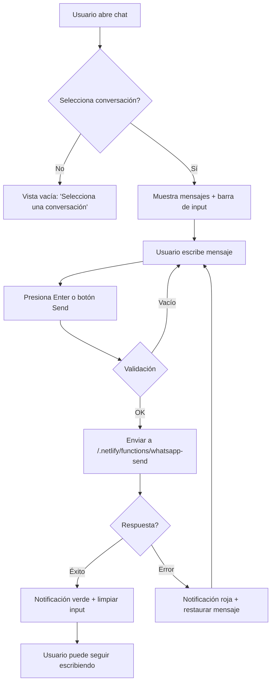

# 🎨 Preview de la Integración de WhatsApp

## Así se ve la nueva interfaz:

### Vista de Chat Actualizada

```
┌─────────────────────────────────────────────────────┐
│ ← [Avatar] Nombre del Contacto          [@] [⋮]    │ ← Header
│   +52 123 456 7890                                  │
├─────────────────────────────────────────────────────┤
│                                                      │
│  [Sparkles] Nuevo prospecto  [v]                   │ ← Info IA (opcional)
│                                                      │
│  ━━━━━━━━━━━━━━ Hoy ━━━━━━━━━━━━━                 │
│                                                      │
│  ┌─────────────────────────┐                       │
│  │ Hola, buenos días       │  10:30 AM             │ ← Mensaje entrante
│  └─────────────────────────┘                       │
│                                                      │
│                        ┌─────────────────────────┐  │
│           09:15 AM     │ ¡Hola! ¿En qué puedo   │  │ ← Mensaje saliente
│                        │ ayudarte?               │  │
│                        └─────────────────────────┘  │
│                                                      │
│  ━━━━━━━━━━━━━ Ayer ━━━━━━━━━━━━━                 │
│                                                      │
│  [Más mensajes antiguos...]                         │
│                                                      │
├─────────────────────────────────────────────────────┤
│ [#] │ Escribe un mensaje...              │ [Send] │ ← Barra de mensajería
└─────────────────────────────────────────────────────┘
```

## Características de la Barra de Mensajería

### Componentes:

1. **Botón de Adjuntos** ([#])
   - Por ahora deshabilitado
   - Preparado para futura implementación

2. **Campo de Texto**
   - Placeholder: "Escribe un mensaje..."
   - Auto-expand hasta 100px de altura
   - Presiona **Enter** para enviar
   - **Shift+Enter** para nueva línea

3. **Botón de Envío** ([Send])
   - Deshabilitado si el mensaje está vacío
   - Color azul (var(--color-primary))
   - Animación de hover

### Estados Visuales:

#### ✅ Mensaje Enviado
```
┌─────────────────────────────────────┐
│                                     │
│  [Notificación flotante]            │
│  ┌────────────────────────┐         │
│  │ ✓ Mensaje enviado      │ Verde   │
│  └────────────────────────┘         │
│                                     │
└─────────────────────────────────────┘
```

#### ❌ Error al Enviar
```
┌─────────────────────────────────────┐
│                                     │
│  [Notificación flotante]            │
│  ┌────────────────────────┐         │
│  │ Error al enviar        │ Roja    │
│  └────────────────────────┘         │
│                                     │
└─────────────────────────────────────┘
```

#### ⏳ Enviando...
```
┌─────────────────────────────────────┐
│                                     │
│ [#] │ Escribe... │ [⟳ Enviando...] │
│                                     │
└─────────────────────────────────────┘
```

## Flujo de Usuario



## Estilos Adaptables

### Tema Oscuro (Default)
- **Input:** `#212e45` (bg-card-hover)
- **Botón Send:** `#3e95d9` (color-primary)
- **Notificación Éxito:** `#4ade80` (verde)
- **Notificación Error:** `#f87171` (rojo)

### Tema Claro
- **Input:** `#f5f7fb` (bg-card-hover light)
- **Botón Send:** `#3e95d9` (color-primary)
- Los colores se ajustan automáticamente según `data-theme="light"`

## Responsive Design

### Desktop (> 768px)
```
┌──────────────────────────────────────────────┐
│  Sidebar  │  Chat completo con barra abajo   │
└──────────────────────────────────────────────┘
```

### Mobile (< 768px)
```
┌─────────────────────────┐
│  Chat fullscreen        │
│  con botón ← atrás      │
│  Barra abajo            │
└─────────────────────────┘
```

## Interacciones

### Teclado
- **Enter:** Enviar mensaje
- **Shift+Enter:** Nueva línea (futuro)
- **Ctrl/Cmd+V:** Pegar (futuro para imágenes)

### Mouse
- **Click en input:** Focus automático
- **Click en Send:** Enviar mensaje
- **Click en [#]:** (Futuro) Adjuntar archivos

## Notificaciones

### Posición
- **Fixed bottom-24** (24px desde el fondo)
- **Left 50%** con **transform translateX(-50%)** (centrado)
- **Z-index 50** (sobre todo excepto modales)

### Animación
- **Entrada:** Fade in + slide up (300ms)
- **Salida:** Fade out (300ms)
- **Auto-hide:** 
  - Éxito: 3 segundos
  - Error: 5 segundos

## Console Logs

Para debugging, busca en la consola del navegador:

```javascript
// Al enviar
[ChatView] Enviando mensaje: { to: "52...", message: "..." }

// Éxito
[ChatView] Mensaje enviado exitosamente: wamid.xxx...
[useWhatsApp] Mensaje enviado exitosamente: wamid.xxx...

// Error
[useWhatsApp] Error: { error: "...", details: {...} }
```

## Variables Clave en el Código

```typescript
// Estado del input
const [messageInput, setMessageInput] = useState('');

// Estado de envío
const { sendMessage, sending } = useWhatsApp();

// Estado de notificación
const [notification, setNotification] = useState<{
  type: 'success' | 'error';
  message: string;
} | null>(null);
```

---

**Tip Pro:** 
Para ver los mensajes en tiempo real mientras se envían, mantén abierta la pestaña Network en las DevTools y filtra por "whatsapp-send".

