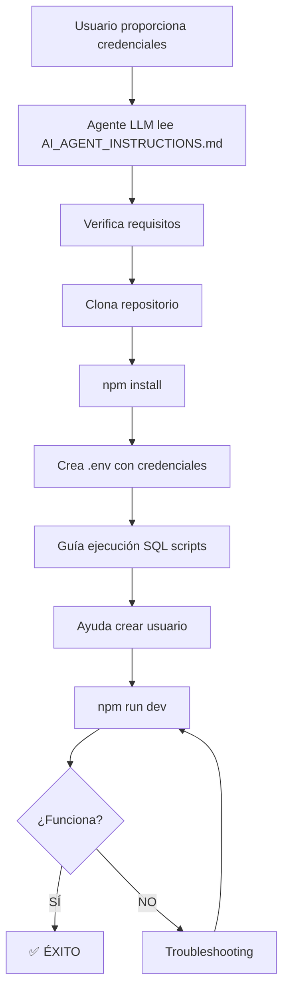

# 🎯 INSTRUCCIONES RÁPIDAS - Para Otro Agente LLM

## 📋 COPIA ESTO Y PÉGALO A CLAUDE/CHATGPT/COPILOT

```
Necesito que me ayudes a instalar y configurar un proyecto CRM.

REPOSITORIO: https://github.com/Novaisolutions/TOI_MONITOR

INSTRUCCIONES COMPLETAS: 
Están en el repositorio en el archivo AI_AGENT_INSTRUCTIONS.md

RESUMEN:
1. Verificar Node.js 18+, npm y Git
2. Clonar el repositorio
3. Instalar dependencias (npm install)
4. Pedirme mis credenciales de Supabase
5. Crear archivo .env con las credenciales
6. Guiarme para ejecutar 7 scripts SQL en Supabase
7. Ayudarme a crear un usuario administrador
8. Iniciar el servidor (npm run dev)
9. Validar que funcione

TIEMPO ESTIMADO: 15-20 minutos

MIS CREDENCIALES DE SUPABASE:
- URL: [VOY A PROPORCIONARLA]
- ANON KEY: [VOY A PROPORCIONARLA]

Por favor lee AI_AGENT_INSTRUCTIONS.md del repo y síguelo paso a paso.
¿Comenzamos?
```

---

## 🚀 EJEMPLO DE USO REAL

### Escenario 1: Configuración Completa Nueva

**Usuario dice a Claude/ChatGPT:**
```
Instala este proyecto para un cliente:
https://github.com/Novaisolutions/TOI_MONITOR

Credenciales Supabase:
- URL: https://xyz123abc.supabase.co
- Key: eyJhbGciOiJIUzI1NiIsInR5cCI6IkpXVCJ9.ejemplo...

Lee AI_AGENT_INSTRUCTIONS.md y guíame paso a paso.
```

**El agente:**
1. ✅ Leerá AI_AGENT_INSTRUCTIONS.md
2. ✅ Te guiará en clonar el repo
3. ✅ Ejecutará npm install
4. ✅ Creará .env con tus credenciales
5. ✅ Te guiará en ejecutar scripts SQL
6. ✅ Te ayudará a crear usuario
7. ✅ Iniciará npm run dev
8. ✅ Validará que funcione

---

### Escenario 2: Solo Conexión a Nueva Base de Datos

**Usuario dice:**
```
Tengo Monitor Base ya instalado.
Solo necesito conectarlo a un nuevo proyecto Supabase.

Nueva URL: https://nuevo-cliente.supabase.co
Nueva Key: eyJhbGciOiJIUzI1NiIsInR5cCI6IkpXVCJ9.nueva...

¿Qué necesito hacer?
```

**El agente responderá:**
```
Para conectar a nueva base de datos:

1. Edita .env:
   VITE_SUPABASE_URL=https://nuevo-cliente.supabase.co
   VITE_SUPABASE_ANON_KEY=eyJhbGciOiJIUzI1NiIsInR5cCI6IkpXVCJ9.nueva...

2. Ejecuta en Supabase SQL Editor (en orden):
   - supabase/update_tables_structure.sql
   - supabase/rls.sql
   - supabase/conversations_optimization.sql
   - supabase/prospectos_optimization.sql
   - supabase/seguimiento_optimizado.sql
   - supabase/prospect_creation_trigger.sql
   - supabase/auto_prospect_movement.sql

3. Crea usuario admin en Supabase Auth

4. Reinicia: npm run dev

¿Necesitas ayuda con algún paso?
```

---

## 📱 PROMPTS CORTOS

### Prompt Mínimo
```
Setup Monitor Base:
https://github.com/Novaisolutions/TOI_MONITOR

Mis credenciales:
URL: [TU_URL]
Key: [TU_KEY]

Guíame usando AI_AGENT_INSTRUCTIONS.md
```

### Prompt con Troubleshooting
```
Configurando Monitor Base, tengo este error:
[PEGA ERROR AQUÍ]

Repo: https://github.com/Novaisolutions/TOI_MONITOR
Contexto: Ver AI_AGENT_INSTRUCTIONS.md

¿Cómo lo soluciono?
```

### Prompt para Deploy
```
Monitor Base ya funciona local.
¿Cómo lo subo a producción en Netlify?

Repo: https://github.com/Novaisolutions/TOI_MONITOR
```

---

## 🎓 ARCHIVOS IMPORTANTES

El agente LLM debe leer estos archivos del repositorio:

| Archivo | Propósito |
|---------|-----------|
| `AI_AGENT_INSTRUCTIONS.md` | 📘 Instrucciones detalladas paso a paso |
| `LLM_PROMPTS.md` | 💬 Ejemplos de prompts para usar |
| `setup-config.json` | ⚙️ Configuración estructurada (parseable) |
| `SETUP_GUIDE.md` | 📗 Guía manual para humanos |
| `README.md` | 📄 Información general del proyecto |
| `QUICKSTART.md` | ⚡ Resumen rápido |

---

## ✅ VALIDACIÓN DE ÉXITO

El agente debe confirmar:

```bash
# 1. Servidor corriendo
✅ npm run dev sin errores

# 2. Navegador abierto
✅ http://localhost:5173 carga

# 3. Login funciona
✅ Usuario puede autenticarse

# 4. Dashboard visible
✅ Datos se cargan correctamente

# 5. Sin errores
✅ Consola del navegador limpia (F12)
```

---

## 🔄 WORKFLOW COMPLETO



---

## 🎯 CASOS DE USO

### Caso 1: Startup desde Cero
```
Tengo:
- ✅ Proyecto Supabase creado
- ✅ Credenciales listas
- ❌ Nada instalado

Agente: Te guía desde cero (20 min)
```

### Caso 2: Ya Tengo Node.js
```
Tengo:
- ✅ Node.js instalado
- ✅ Supabase listo
- ❌ Proyecto no clonado

Agente: Desde clone hasta running (15 min)
```

### Caso 3: Solo Cambiar Conexión
```
Tengo:
- ✅ Proyecto instalado
- ✅ Funcionando local
- ❌ Quiero conectar a nueva DB

Agente: Solo .env y scripts SQL (5 min)
```

---

## 💡 TIPS PARA MEJORES RESULTADOS

### ✅ HACER:
```
✅ "Lee AI_AGENT_INSTRUCTIONS.md del repo y síguelo"
✅ "Mis credenciales son: [URL] y [KEY]"
✅ "Valida cada paso antes de continuar"
✅ "Si hay error, dime cómo solucionarlo"
```

### ❌ EVITAR:
```
❌ "Solo dame los comandos" (muy genérico)
❌ No proporcionar credenciales completas
❌ Saltarse validaciones de pasos
❌ No especificar sistema operativo si hay error
```

---

## 📞 SI EL AGENTE NO PUEDE AYUDAR

**Plan B:**
1. Lee tú mismo: `AI_AGENT_INSTRUCTIONS.md`
2. Sigue paso a paso manualmente
3. Usa: `SETUP_GUIDE.md` como referencia
4. Consulta: `QUICKSTART.md` para resumen

**Soporte Humano:**
- 📧 soporte@novaisolutions.com
- 🐛 GitHub Issues: https://github.com/Novaisolutions/TOI_MONITOR/issues

---

## 🎉 RESULTADO ESPERADO

Después de ~20 minutos con el agente LLM:

```
✅ Proyecto clonado en tu máquina
✅ Dependencias instaladas
✅ Conectado a tu Supabase
✅ Base de datos configurada
✅ Usuario admin creado
✅ Servidor corriendo en localhost:5173
✅ Puedes hacer login
✅ Dashboard funcionando

🚀 LISTO PARA USAR
```

---

## 📊 EJEMPLO DE CONVERSACIÓN REAL

```
TÚ:
Instala Monitor Base. Repo: github.com/Novaisolutions/TOI_MONITOR
URL: https://abc123.supabase.co
Key: eyJhbGciOiJIUzI1NiIsInR5cCI6IkpXVCJ9...
Lee AI_AGENT_INSTRUCTIONS.md

AGENTE:
Perfecto, configuremos Monitor Base.
Primero verificaré requisitos...
[ejecuta node -v]
✅ Node.js 18.20.8 detectado

Clonando repositorio...
[ejecuta git clone]
✅ Repositorio clonado

Instalando dependencias...
[ejecuta npm install]
✅ 478 paquetes instalados

Creando .env...
✅ Configurado con tus credenciales

Ahora ejecuta estos SQL en Supabase:
1. update_tables_structure.sql
2. rls.sql
...

¿Los ejecutaste? 

TÚ: Sí

AGENTE:
Perfecto. Crea usuario admin:
Email: admin@tuempresa.com
Password: [segura]

¿Listo?

TÚ: Sí

AGENTE:
Iniciando servidor...
[ejecuta npm run dev]
✅ http://localhost:5173 abierto

¡Configuración completa! 
Prueba hacer login con admin@tuempresa.com
```

---

**¿Listo para empezar?** 🚀  
Copia el prompt de arriba y pégalo en tu agente LLM favorito.

---

© 2025 Novai Solutions
